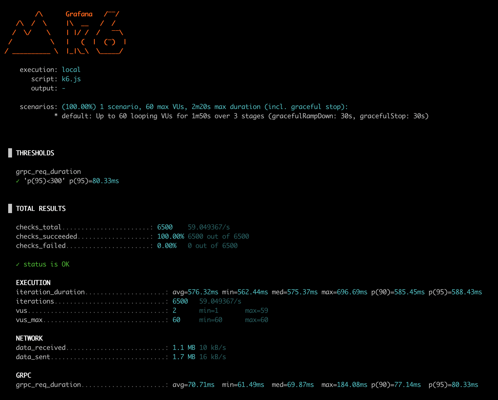
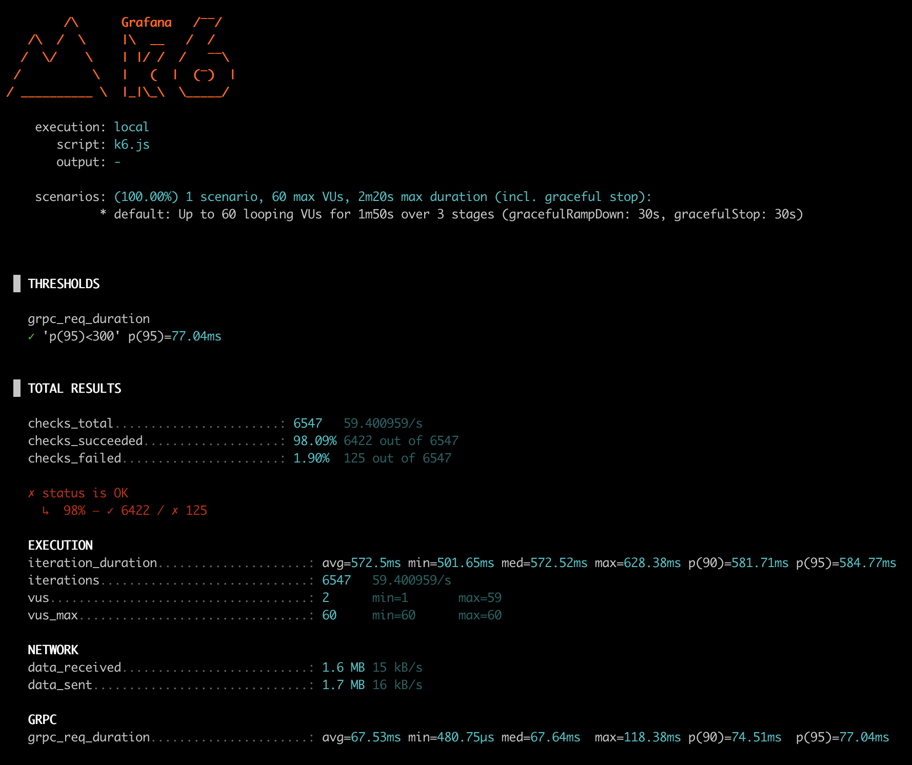
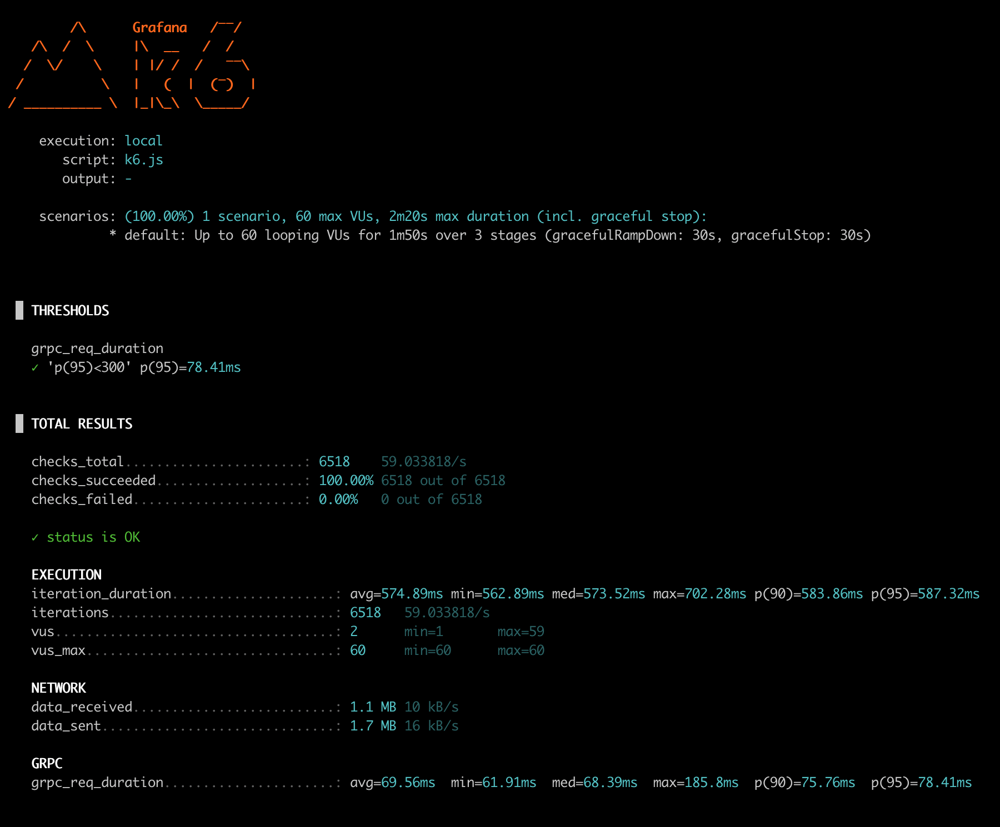

# Gruf Relay - gRPC Proxy Server

Gruf Relay is a lean and performant gRPC proxy server crafted to optimize resource usage within microservice architectures, especially those leveraging single-threaded languages like Ruby. In Kubernetes deployments, a common pattern involves sidecar containers, which inevitably consume resources alongside your primary application. By deploying Gruf Relay within a pod, you unlock the ability to run multiple Ruby workers (hosting your Gruf application) as sub-processes within a single container. Gruf Relay then intelligently load balances gRPC requests across these workers, maximizing CPU utilization within the pod, without the overhead of additional sidecars or pod scaling.

Key features include built-in load balancing, which ensures requests are evenly distributed across available workers, and robust health checks that contribute to high availability. Kubernetes-native readiness and liveness probes are present for seamless integration with orchestration platforms. Comprehensive metrics provide detailed insights into performance and resource consumption. A built-in request queue is also present, preventing request drops during bursts of traffic, enhancing overall system reliability. Ultimately, Gruf Relay amplifies pod capacity by enabling multiple Ruby instances to coexist within a single pod, sharing sidecars and substantially reducing overall resource demand.

## Table of Contents

- [Features](#features)
- [Benchmarks](#benchmarks)
  - [Test Parameters](#test-parameters)
  - [Summary of Results](#summary-of-results)
  - [Test Insights](#test-insights)
- [Installation](#installation)
  - [Quick Install](#quick-install)
  - [Ruby Gem](#ruby-gem)
- [Configuration](#configuration)
  - [Config File (gruf-relay.yml)](#config-file-gruf-relayyyml)
  - [Environment Variables](#environment-variables)
- [Usage](#usage)
  - [Endpoints](#endpoints)
- [Architecture](#architecture)
  - [Key Components](#key-components)
- [Example Usage](#example-usage)
  - [Probes](#probes)
  - [Scripts](#scripts)
- [Contributing](#contributing)
- [License](#license)

## Features

- **Random Load Balancing**: Distribute requests across healthy backend instances.
- **Health Checking**: Regular gRPC health checks with configurable intervals.
- **Dynamic Configuration**: YAML config + environment variables support.
- **Metrics Exposure**: Prometheus metrics endpoint for monitoring.
- **Worker Management**: Automated worker lifecycle management.
- **Horizontal Scaling**: Easily scale backend worker instances.
- **Structured Logging**: JSON-formatted logs with configurable levels.
- **Request Handling**: Includes request queuing to help prevent request loss, offering enhanced reliability compared to a basic Gruf setup.

## Benchmarks

To ensure **Gruf Relay** provides exceptional performance and stability, a series of load tests were conducted using the [k6](https://k6.io/) tool. Below are the results of comparison benchmarks between **Gruf Relay**, **Gruf**, and **Gruf with Backlog Patch**, each executed under identical conditions.

### Test Parameters

- **System Configuration**: MacOS 15.4.1, Apple M1 Pro CPU
- **CPU and RAM Limits**:
  - CPU Limit: 500m for Gruf (default & backlog patch), 1500m for Gruf Relay.
  - Memory Limit: 400Mi for Gruf (default & backlog patch), 1200Mi for Gruf Relay.
- **Deployment Configuration**:
  - Gruf & Gruf with Patch: 6 pods with 5 threads each (30 total threads)
  - Gruf Relay: 2 pods with 3 workers per pod, each worker using 5 threads (30 total threads)
- **Testing Tool**: k6
- **Scenario**:
  - Ramp up to 60 users over 3 stages.
  - Max 60 Virtual Users (VUs) during 1m50s run duration.
  - Graceful cooldown and stop of 30 seconds each.
  - Script: `k6.js`.
  - **RPC Method Simulation**: The benchmark simulates realistic workloads by calling an RPC method that includes both I/O bound operations and CPU-bound operations. This approach ensures a more accurate representation of real-world server load.


### Summary of Results

| Test                        | Total Requests | Success Rate | Error Rate | p95 Latency   |
|-----------------------------|----------------|-------------:|-----------:|---------------|
| **Gruf Relay**              | **6500**       | **100%**     | **0%**     | **80.33ms**   |
| **Gruf**                    | 6547           | 98.09%       | 1.90%      | 77.04ms       |
| **Gruf with Backlog Patch** | 6518           | 100%         | 0%         | 78.41ms       |

### Test Insights

1. **Gruf Relay**
   - Achieved a perfect **100% success rate** with zero errors during load testing.
   - Demonstrated consistent and predictable performance under high concurrency.
   - Reliable queuing and distribution mechanisms ensure no dropped requests.
   - 

2. **Gruf (Default)**
   - Faced **1.90% error rate**, suggesting instability under concurrent traffic.
   - Lack of request queuing caused dropped requests under high concurrency.
   - Slightly faster average iteration duration compared to Gruf Relay, but with lower reliability.
   - 

3. **Gruf with Backlog Patch**
   - Successfully matched **Gruf Relay's 100% success rate** by mitigating dropped requests via custom request queuing.
   - Introduced operational complexity due to the backlog patch, which requires compatibility checks for every minor version update of the `grpc` gem.
   - Slight increase in latency (~2ms) likely due to additional queuing logic.
   - 

**Gruf Relay** performed well in this benchmark, demonstrating:
- **Zero errors** and **100% success rate**.
- Stable latency.
- Built-in queuing, eliminating the need for custom patches.

**Gruf with Backlog Patch** achieved comparable success, but adds operational complexity. **Gruf (Default)** exhibited errors under load due to insufficient request handling.

## Installation

### Quick Install
```bash
# Install with Go
go install github.com/bibendi/gruf-relay/cmd/gruf-relay@latest

# Or build from source
git clone https://github.com/bibendi/gruf-relay
cd gruf-relay
make build
```

### Ruby Gem

Gruf Relay is also available as a Ruby gem containing the pre-compiled binary for different platforms:

```bash
# Install the gem
gem install gruf-relay

# Or add to your Gemfile
gem "gruf-relay"
```

After installation, you can run Gruf Relay using:

```bash
bundle exec gruf-relay
```

The gem packages binaries for multiple platforms including:

- Linux AMD64 (x86_64)
- Linux ARM64
- macOS AMD64 (x86_64)
- macOS ARM64 (Apple Silicon)

## Configuration

Gruf Relay prioritizes configuration in the following order:

1.  **Environment Variables**: Override configuration settings.
2.  **Configuration File**: If the `CONFIG_PATH` environment variable is set, Gruf Relay attempts to load the configuration from the specified YAML file. If not set, it defaults to searching for a file named `gruf-relay.yml` in the current directory.
3.  **Default Values**: If a configuration value is not provided by either environment variables or the config file, the default value is used.

### Config File (gruf-relay.yml)
```yaml
log:
  level: "debug"
  format: "json"
server:
host: "0.0.0.0"
port: 8080
  proxy_timeout: "5s"
workers:
  count: 2
  start_port: 9000
  metrics_path: "/metrics"
  pool_size: 5
health_check:
  interval: "5s"
  timeout: "3s"
probes:
  enabled: true
  port: 5555
metrics:
  enabled: true
  port: 9394
  path: "/metrics"
  interval: "5s"
```

### Environment Variables

The following environment variables can be used to override settings in the `config.yaml` file. Environment variables take precedence over the configuration file.

*   `LOG_LEVEL`: Logging level (default: `debug`). Possible values: `debug`, `info`, `warn`, `error`.
*   `LOG_FORMAT`: Logging format (default: `json`). Possible values: `json`, `text`.
*   `SERVER_HOST`: Host address for the gRPC proxy (default: `0.0.0.0`).
*   `SERVER_PORT`: Port for the gRPC proxy (default: `8080`).
*   `SERVER_PROXY_TIMEOUT`: Timeout for proxy requests (default: `5s`). Must be a valid duration string (e.g., "10s", "1m", "1m30s").
*   `HEALTH_CHECK_INTERVAL`: Interval for health checks (default: `5s`).  Must be a valid duration string (e.g., "10s", "1m", "1m30s").
*   `HEALTH_CHECK_TIMEOUT`: Timeout for health checks (default: `3s`).  Must be a valid duration string (e.g., "10s", "1m", "1m30s").
*   `WORKERS_COUNT`: Number of backend workers (default: `2`).
*   `WORKERS_START_PORT`: Starting port for workers (default: `9000`).
*   `WORKERS_METRICS_PATH`: Path for worker metrics endpoint (default: `/metrics`).
*   `WORKERS_POOL_SIZE`: Size of the worker pool (default: `5`).
*   `PROBES_ENABLED`: Enable/disable liveness/readiness probes (default: `true`).
*   `PROBES_PORT`: Port for liveness/readiness probes (default: `5555`).
*   `METRICS_ENABLED`: Enable/disable metrics exposure (default: `true`).
*   `METRICS_PORT`: Port for Prometheus metrics (default: `9394`).
*   `METRICS_PATH`: Path for Prometheus metrics (default: `/metrics`).
*   `METRICS_INTERVAL`: Interval for metrics collection (default: `5s`). Must be a valid duration string (e.g., "10s", "1m", "1m30s").

Example:

```bash
export SERVER_PORT=8081
export WORKERS_COUNT=3
export METRICS_ENABLED=true
export HEALTH_CHECK_INTERVAL=10s
```

## Usage

```bash
# Start server with config
./gruf-relay
```

### Endpoints

| Endpoint          | Port  | Description                                  |
|-------------------|-------|----------------------------------------------|
| gRPC Proxy        | 8080  | Main proxy endpoint                           |
| Metrics           | 9394  | Prometheus metrics                            |
| Liveness Probe    | 5555  | Kubernetes liveness check (`/liveness`)       |
| Readiness Probe   | 5555  | Kubernetes readiness check (`/readiness`)     |
| Startup Probe     | 5555  | Kubernetes startup check (`/startup`)         |

## Architecture

### Key Components
1. **Manager**: Controls worker lifecycle
2. **Health Checker**: Monitors worker availability
3. **Random Balancer**: Distributes requests evenly
4. **Request Queue**: Buffers incoming requests to prevent drops during high load.
5. **Metrics Server**: Exposes Prometheus metrics
6. **Probes Server**: Provides endpoints for liveness, readiness and startup probes.

## Example Usage

To run with the example Gruf application:

```bash
# Run the Gruf Relay server with the example application
make run
```

This command will start Gruf Relay and the example Gruf application side-by-side, allowing you to test the proxy's functionality.

### Probes

#### Startup Probe
```bash
curl -v http://localhost:5555/startup
```

#### Readiness Probe
```bash
curl -v http://localhost:5555/readiness
```

#### Liveness Probe
```bash
curl -v http://localhost:5555/liveness
```

### Scripts

#### Triggering a Job
```bash
example/script/job
```

#### Checking Health
```bash
example/script/health_check
```

## Contributing

Contributions welcome!

## License

MIT

---

Made with ❤️ by @bibendi
